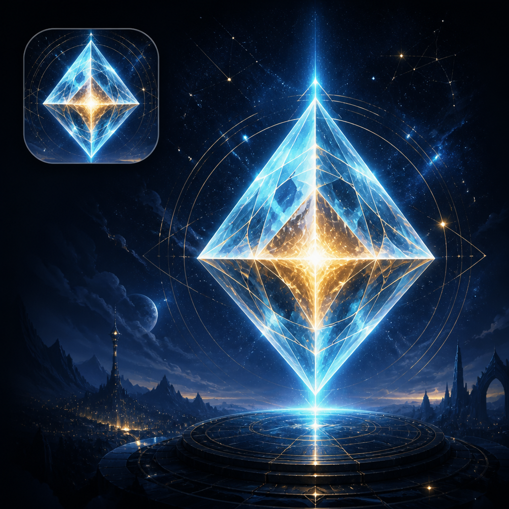

# Crystal Companion



A digital crystal guide — luminous AI companion for healing, protection, and manifestation.

## Quick start

Double-click `start.bat`, or:

```bash
npm install
npm start
```

Press **Awaken** to birth the crystal and the opening song.

Configure your oracle under **Attunement** (OpenRouter, Ollama, OpenAI, or Anthropic).

See [USER_GUIDE.md](./USER_GUIDE.md) for the full guide.

## Releases

Download installers for **Windows**, **macOS**, and **Linux** from the [GitHub Releases](https://github.com/AaronGrace978/CrystalCompanion/releases) page.

```bash
npm run dist        # package for this OS
npm run dist:win    # Windows NSIS + portable
npm run dist:mac    # macOS DMG + zip
npm run dist:linux  # AppImage + deb
```

Multi-platform builds are produced by GitHub Actions when a `v*` tag is pushed.
